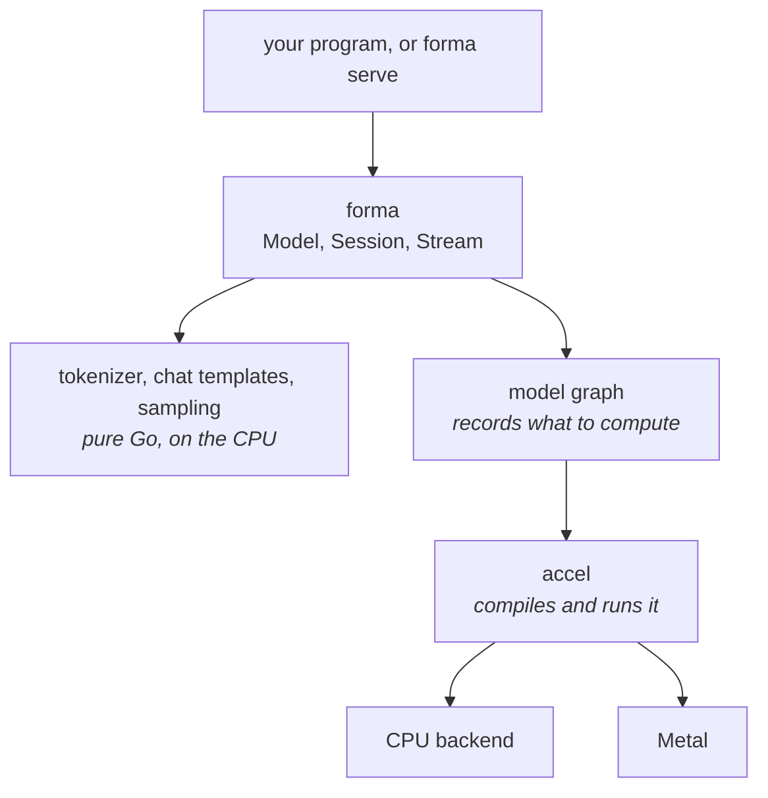

# Orientation

What Forma is, what it is made of, and what that means for you as someone
running a model.

## One binary

Forma builds with `CGO_ENABLED=0`. There is no C++ runtime, no Python, no vendor
SDK, and no shared library to match against your driver. You cross-compile it
the way you cross-compile any Go program, and the result runs on a machine with
nothing installed on it.

That is the main reason to choose Forma over a wrapper around llama.cpp or
vLLM. If you already run Python and serve on NVIDIA hardware, vLLM is faster and
more complete today, and you should use it.

## What runs where



**The text layer never touches a GPU.** Tokenizing, rendering a chat template
and choosing the next token are ordinary Go running on the CPU. They are exact,
and they behave identically on every platform.

**The model is a graph, not a program.** Forma describes the computation once;
[accel](https://github.com/golang-design/accel) compiles it and runs it. That is
why the same model runs on the CPU backend and on Metal with no per-backend
code, and why Forma gains a backend when accel adds one.

**The layer below decides what is possible.** Forma writes no GPU code, so a
limit you meet, a precision that is not offered or an architecture that does
not run yet, is usually accel's. Each one is recorded with its reason, so it is
something you can plan around.

## Backends

| backend | where | status |
| --- | --- | --- |
| Metal | Apple silicon | **works.** Qwen3-0.6B at f16, one conversation, on an 8-core Apple machine: about 18 tokens a second decoding and about 170 ms to the first token (measured August 2026) |
| CPU | everywhere | **works, and is very slow**: minutes per token rather than a fraction of a second, because the backend runs each piece of work in turn. Use it for correctness, not for serving |
| Vulkan, D3D12, WebGPU | | designed in accel, not built |

Forma picks the best available device by default. `--device cpu` or
`--device metal` forces one, and naming a device that is not present is an
error rather than a fallback.

## Speaking to it

`forma serve <model-dir>` serves the same model over several wire APIs, so most
clients work unchanged:

| you send | route |
| --- | --- |
| OpenAI Chat Completions | `/v1/chat/completions` |
| Anthropic Messages | `/v1/messages` |
| OpenAI Responses | `/v1/responses` |
| OpenAI legacy completions, no chat template | `/v1/completions` |

They are translated through one neutral request shape rather than handled
separately, so a feature works the same way whichever you use.

**Ask for a JSON schema and you get one.** At every step, the tokens that could
not continue a document matching your schema are given probability zero, so
the answer parses and matches without a retry loop. A schema keyword Forma
cannot turn into that constraint, such as `minimum`, is refused with the
keyword and the reason when you send it.

**A setting Forma cannot honor is never dropped quietly.** One that would change
the answer, such as asking for four completions at once, is refused by name.
One that cannot change the answer runs anyway and is listed in an
`X-Forma-Loss` response header.

The server binds to localhost. Exposing it needs `--public`, and it has no
authentication. [Serving](serving.md) covers the whole HTTP surface.

## Precision, and why it is chosen for you by default

A model has to fit in memory. Roughly:

| stored as | bytes per parameter | a 4B model | a 27B model |
| --- | --- | --- | --- |
| f16 | 2 | 7.5 GiB | 50 GiB |
| int8 | 1.06 | 4.0 GiB | 27 GiB |
| int4 | 0.53 | 2.0 GiB | 13 GiB |

Each step down costs some accuracy, by a bounded amount. On a machine whose
memory is shared with everything else, f16 stops fitting early, so int8 is often
the only way a model loads rather than an optimization. int4 is the same
sentence one size up: a 27B model does not fit a 24 GiB device at int8 and does
at int4.

**Forma will not choose int4 for you unless int8 does not fit.** Unlike the step
from f16 to int8, the step to int4 is not uniformly a small loss: it does better
than int8 on some weights and worse on others, so picking it to save memory you
were not short of is a trade you did not ask for. Ask for it with
`--precision int4` when you need it.

Forma chooses by what fits and **prints which it chose**, with the footprints it
compared. `forma info` shows the same choice without loading any weights.

One weight does not shrink at int4: the embedding table, which the model reads a
row at a time rather than multiplying against. It stays at int8, as it does in
other quantizers, and costs little.

## The key/value cache, the other half of your memory

Every token adds to a cache the model reads back on the next step. A cache is
sized by the context you ask for, not by the context you use: asking for a 32k
context reserves 32k positions of memory whether or not a conversation gets
there. The default is 4096 positions, and a larger `--context` prints its cost
before anything is allocated.

Per position, the cache costs

```
2 × layers × key/value heads × head dimension × bytes per element
```

A session's own cache is stored at f32, 4 bytes per element. The shared pool
that `--prefix-cache process` and `--batched` use is stored at f16, half that.
For Qwen3-4B (36 layers, 8 key/value heads, head dimension 128):

| context | a session's own cache (f32) | in the shared pool (f16) |
| --- | --- | --- |
| per position | 288 KiB | 144 KiB |
| 2048 | 576 MiB | 288 MiB |
| 4096 | 1.1 GiB | 576 MiB |
| 8192 | 2.3 GiB | 1.1 GiB |
| 32768 | 9 GiB | 4.5 GiB |

`forma info` prints these figures for any model. Narrowing the pool to f16
narrows the inputs to the attention arithmetic, not the arithmetic itself, the
same trade the weights already make.

## Prompt caching

Most of what a client sends is usually the same as last time: a system prompt,
tool definitions, the earlier turns of a conversation. Forma can keep the work
it already did for that shared beginning and skip it, so a follow-up question
pays for its own new tokens and not for the transcript in front of them. For a
long conversation and a short question, that is most of the wait before the
first token.

It is **off unless you ask for it**, with `--prefix-cache` on `forma serve` or
`forma.WithPrefixCache` in the library. There are two scopes:

| scope | reuses | costs |
| --- | --- | --- |
| `session` | work done earlier in the same conversation | each session's own cache |
| `process` | work done for any conversation that sends the same `cache_salt`, so a shared system prompt is prefilled once | one shared pool at f16, sized by `--kv`; which slot a request lands on stops mattering |

Three things to know before you turn it on:

- **The answer is the same in distribution, not in bytes.** A reused prefix was
  computed under a different prefill shape, and floating point addition is not
  associative.
- **It is not a response cache.** The model still generates. Only the reading of
  your prompt is skipped, so the same question can still get a different answer.
- **A hit is visible in timing.** Under `process` scope, a caller whose prompt
  hits another caller's cache can tell. `cache_salt` on a request bounds what it
  may share with, and under `process` scope a request without one shares with
  nothing; [Serving](serving.md#prompt-caching-and-cache_salt) says exactly
  how. Anything that serves several tenants from one
  process should set a salt per tenant.

## Serving several requests: pooled sessions

By default `forma serve` keeps a fixed pool of sessions and routes each request
to the one already holding the longest matching beginning. `--slots N` sets the
size, 4 by default or fewer if the device holds fewer. Under `session` scope it
is two numbers at once:

- **how many requests generate at the same time.** Over that, requests queue,
  and past the queue they are refused with 429 and a `Retry-After`.
- **how many conversations keep their cache between turns.** A conversation's
  next turn reuses its own work if fewer than N other conversations were
  served since its last turn.

Under `process` scope the cache lives in one shared pool, so `--slots` is
concurrency alone and a conversation that sends a `cache_salt` finds its own
work however many others were served in between. One that sends none shares
nothing, not even with its own earlier turns.

The cost is memory, and it is not conditional. Every slot's cache, or the shared
pool under `process` scope, is reserved when the process starts and held until
it exits, whether or not a second request arrives. `forma serve` prints the whole calculation at startup: what one slot
reserves, what N of them come to, what is left after the weights, and how many
the device would hold. If you ask for more than fits, it says so then rather
than failing under load.

Pooled sessions each run their own forward pass, so concurrent requests
interleave and total throughput is close to what one conversation gets.

## Running several conversations in one pass

Reading the weights is most of what a decode step costs, and a step that
produces one token reads all of them. Two conversations stepping together read
the weights once and produce two tokens. That is where a server's throughput
comes from.

`forma serve --batched` does this. Every in-flight request is a slot in one
forward pass, 8 slots by default. A long prompt does not stall the conversations
decoding beside it: it is prefilled in chunks of up to 512 tokens that ride in
the same pass as their decode steps.

What changes under `--batched`:

- **A slot costs a page table, not a context.** The key/value state of every
  slot lives in one shared pool, so `--batched` implies
  `--prefix-cache process`. `--kv` sizes the pool; the default is slots times
  context.
- **Admission reserves room for an answer, not just a prompt.** A request is
  admitted only if its prompt and a reserve for its answer fit together, 512
  positions or half the context, whichever is smaller. A server full of requests
  that fit their prompts and cannot grow would finish nothing, so a refusal you
  can see is preferred.
- **A request without a `cache_salt` shares with nothing**, including its own
  conversation's earlier turns.

It is opt-in. In the library, `Model.NewRunner` is the same engine, and
`Model.NewScheduler` is the scheduler under it for a caller that wants to drive
the steps itself.

## Which models

Forma runs the **Qwen3 dense** family, 0.6B, 1.7B, 4B, 8B, 14B and 32B, read
directly from a Hugging Face safetensors checkpoint.

The newer hybrid models, Qwen3.5 and Qwen3.8, use a different architecture
(`qwen3_5`): three of every four layers use linear attention. Forma recognizes
it, reads its configuration and weight map, and refuses to run it by name,
because one operator it needs is not in accel yet. The mixture-of-experts
sibling is refused with the list of architectures Forma knows. This page will
change when either runs.

## What Forma will not do

- **Guess.** A model it does not recognize is refused with the list of what it
  knows, rather than run through a generic path that produces fluent nonsense.
- **Truncate your context.** If a conversation exceeds the cache, Forma says so.
  It does not silently drop the beginning.
- **Ignore a request field.** A setting that would change the answer is refused
  by name. One that cannot change the answer runs anyway, and Forma names it in
  a response header rather than in silence.

## Where to go next

- [Commands](commands.md): every command and the flags that matter.
- [Serving](serving.md): the HTTP routes, request fields, admission and metrics.
- The [package documentation](https://pkg.go.dev/latere.ai/x/forma), for
  embedding Forma in a Go program.
- The design, and why Forma is built the way it is, lives in
  [`../specs/`](../specs/README.md). It is written for people changing Forma,
  and you should not need it to run a model.
